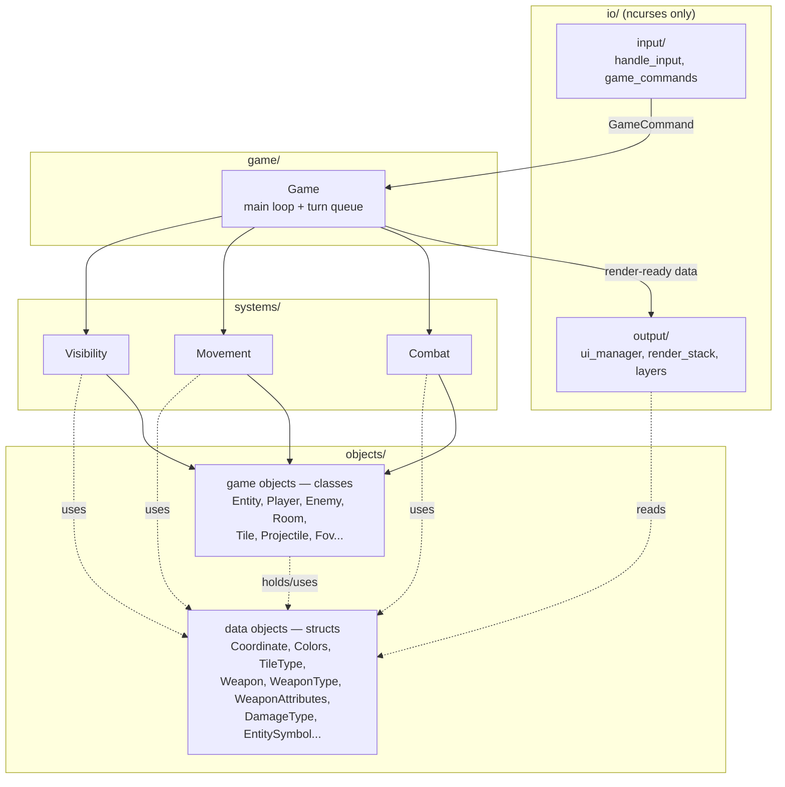
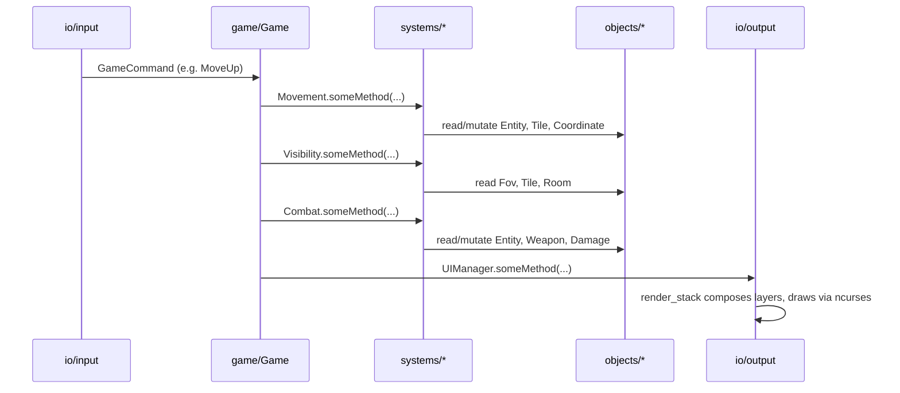

# Architecture

> **Migration complete.** The `objects/`/`systems/`/`game/`/`io/` module
> layout tracked by #219 (and its sub-issues #220-227) has fully landed; the
> file tree and module map below describe the current state, not a target.
> One deliberate wrinkle worth flagging: `game/game.cpp`'s door-transition
> logic calls `room_loader::inwardOfDoor(...)` (from `preload/room_loader.h`)
> at runtime, not just at load time — a `game/` → `preload/` dependency that
> doesn't show up in the dependency diagram below, since `preload/` is a
> load-time-only module the diagram doesn't otherwise model.

## Reference: current file tree
 
```text
include
  game/            game.h, services.h, logger.h, level_data.h
  preload/         level_loader.h, level_meta.h, room_loader.h,
                    room_generator.h, enemy_catalog.h
  systems/
    movement/      movement.h, pathfinding.h, goal_map_cache.h,
                    move_enemy.h, move_player.h
    combat/        combat.h, damage_application.h, damage_source.h,
                    projectile_movement.h, projectile_spawn.h
    visibility/    visibility.h, delta.h, recompute.h, update.h
  objects/
    fovs/          fov.h, ellipse_fov.h
    entities/      enemy.h, entity_symbol.h, entity.h, player.h
    tiles/         tile_type.h, tile.h
    room/          room.h, room_dimensions.h
    weapons/       weapon.h, weapon_attributes.h, weapon_type.h, projectile.h
    damage/        damage.h, damage_type.h
    coordinate.h, direction.h, colors.h, map.h, door_connections.h
  io/
    input/         game_commands.h, handle_input.h
    output/
      layers/       debug_layer.h, entity_layer.h, hud_layer.h, map_layer.h
      colors.h, render_stack.h, render_state.h, window_position.h
    ui_manager.h
```

`preload/` sits outside the `objects/`/`systems/`/`game/`/`io/` grouping — it's a
load-time-only module, described in its own subsection under Module Map below.
 
<!-- src/ mirrors this same tree for .cpp implementations. -->
 
---
 
## 1. Coupling Rules
 
This is the actual architecture — everything else in this doc is detail
hanging off these seven rules.
 
1. **Game objects (classes) are mutually exclusive.** No class under
   `objects/` may hold a reference to, call a method on, or `#include`
   another class under `objects/`. `Entity` does not know about `Room`.
   `Player` does not know about `Enemy`.
2. **Object methods touch at most one attribute at a time.** A method on a
   class in `objects/` may only get or set a single attribute, or perform a
   simple check against the object's own attributes — never combine or
   mutate multiple attributes based on outside state, and never take another
   game-object class as an argument. Behavior that does that belongs in
   `systems/`. Two examples from this migration: `Entity::takeDamage` used
   to look up current health, subtract, clamp, and set a damaged flag in one
   method; that combined logic is now `systems::combat::applyDamage`, which
   drives `Entity::setHealth`/`getHealth` directly. `Enemy::planMove`/
   `resolveMove` — an AI state machine — moved to free functions in
   `systems/movement`, which now drive `Enemy`'s plain `getAIState`/
   `setAIState` (and similar) accessors.
3. **Data objects (structs) are the one exception.** Plain-data types with
   no behavior — `Coordinate`, `Colors`, `TileType`, `Weapon`, `WeaponType`,
   `WeaponAttributes`, `DamageType`, `EntitySymbol`, `DoorConnection` —
   carry no logic, so anything may hold or pass them freely. They're the
   shared currency that's allowed to cross boundaries other things can't.
4. **Systems are the only place two game objects are allowed to interact —
   and systems are mutually exclusive too.** If `Combat` needs an
   `Entity`'s `Weapon` to compute `Damage`, that logic lives in
   `systems/combat.h` — never inside `Entity` or `Weapon` themselves, and
   never inside another system either. `combat.h` never calls into
   `movement.h` or `visibility.h` directly; `game/` is the only thing that
   sequences them.
5. **`game` orchestrates; it doesn't decide.** `game/game.h` owns the main
   loop and the turn queue and calls systems in sequence. It should not
   contain gameplay rules ("how much damage does a sword do") — that's
   `Combat`'s job.
6. **`ui` knows nothing about game logic or game object classes — but it
   may read data objects directly.** No file under `io/` may `#include` a
   class from `objects/` or anything from `systems/`. It *may* `#include`
   data-object structs straight from `objects/` (e.g. `EntitySymbol`,
   `Colors`, `Coordinate`) and turns them into ncurses draw calls —
   nothing more.
7. **Dependencies point one way:**
   `io/input → game → systems → objects`, `game → io/output`, and
   `io/output → objects` (data objects only). Nothing downstream ever
   calls back upstream, and `ui` never reaches into `systems/` or a class
   in `objects/`. **One accepted exception:** `systems/` `.cpp` files that
   need `GameServices` (RNG streams) `#include "game/services.h"` directly,
   since `game/` is where it's defined. This is a one-way, read-only handle
   to a shared service passed down by `game/` at every call site (`Game`
   always supplies the `GameServices&`; no `systems/` file constructs or
   reaches for one on its own) — not a call back upstream — but it is a
   genuine `#include` from `systems/` into `game/`, so it's called out here
   rather than left silently contradicting the rule.
## 2. Dependency Diagram
 

 
## 3. One Turn, End to End
 

 
## 4. Module Map
 
### `objects/` — the nouns
 
- **Responsibility:** Defines every "thing" in the game world, as either a
  behavior-bearing **class** or a behavior-free **struct**.
- **Owns / knows about:** its own internal state; any data-object structs
  it holds.
- **Does NOT know about:** any other class in `objects/`; anything in
  `systems/`, `game/`, or `io/`.
- **Depends on:** only the data-object structs within `objects/`.
- **Depended on by:** `systems/` (that's the only place classes and structs
  from here get combined into behavior), and `io/output` (reads
  data-object structs directly for rendering — never the classes).
 
### `systems/` — the verbs
 
- **Responsibility:** The only layer where multiple game objects are
  allowed to interact. Each system takes objects/structs in, applies
  connecting logic, and mutates or reads state.
- **Owns / knows about:** how to combine specific object types to produce a
  gameplay outcome.
- **Does NOT know about:** `io/`, at all — nor other systems. `combat.h`
  never calls `movement.h` or `visibility.h` directly; each system is only
  ever called by `game/`.
- **Depends on:** `objects/`.
- **Depended on by:** `game/`.
 
### `game/` — the orchestrator
 
- **Responsibility:** Owns the main loop and turn queue. Calls systems in
  sequence, then calls `UIManager` to render the result. Stays thin —
  sequencing only, no gameplay rules.
- **Owns / knows about:** overall world state, turn order, which system
  runs when, when to render.
- **Does NOT know about:** ncurses internals, or how a system resolves its
  logic internally (only calls its public interface).
- **Depends on:** `systems/` (calls each one), `io/` (polls input, triggers
  render).
- **Depended on by:** nothing — this is the composition root.
- **Key files:** `game.h` (loop/state), `services.h` (two seeded
  `std::mt19937` RNG streams — one for spawn/level generation, one for enemy
  movement, offset by one seed so the streams don't start identical),
  `logger.h` (cross-cutting, usable from anywhere).

### `preload/` — load-time construction only

- **Responsibility:** Builds the initial `LevelData` from on-disk level,
  room, and enemy config — everything needed to hand `game/` a fully formed
  level before the first turn runs.
- **Owns / knows about:** level/room/enemy file formats and how to parse
  them into `objects/` types.
- **Does NOT know about:** `systems/`, `io/`, or per-turn gameplay rules.
- **Depends on:** `objects/`.
- **Depended on by:** `game/` only — at construction, and again on door
  transitions (`room_loader::inwardOfDoor`), since `game/` does not persist
  the load-time context itself.

### `io/` — input & output only
 
- **Responsibility:** All ncurses interaction. Translates raw key input
  into `GameCommand`s for `game/` to consume, and turns world state into
  drawn frames. **Zero knowledge of game object classes or game logic** —
  but it's allowed to read data-object structs directly.
- **Owns / knows about:** ncurses windows, color pairs, screen layout, raw
  key codes.
- **Does NOT know about:** `Entity`, `Player`, `Room`, or any other
  class/rule from `objects/` or `systems/`.
- **Depends on:** ncurses (external); data-object structs read directly
  from `objects/` (e.g. `EntitySymbol`, `Colors`, `Coordinate`).
- **Depended on by:** `game/` only.
