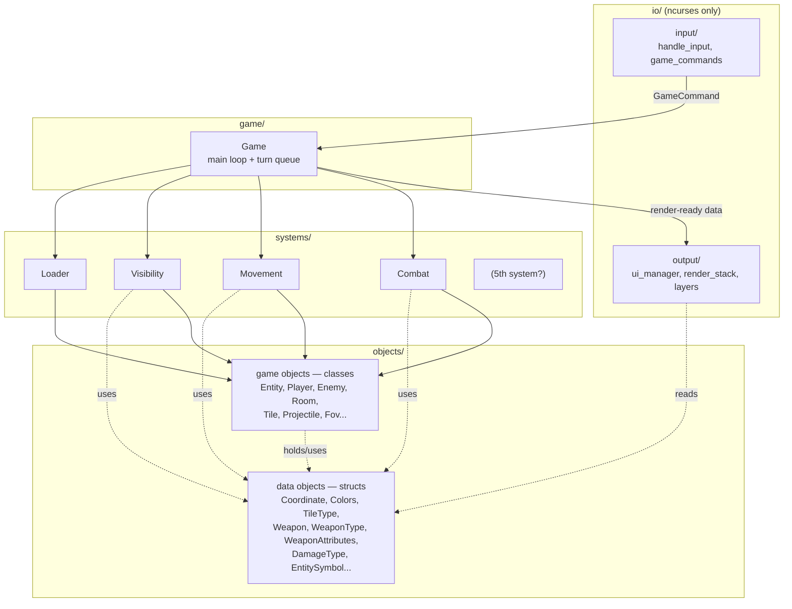
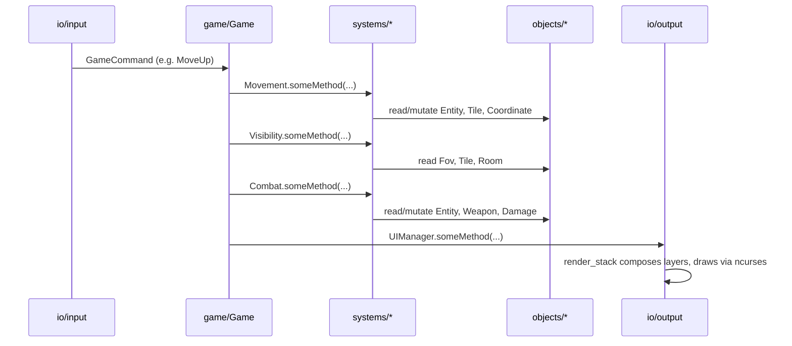

# Architecture

> **Migration in progress.** This doc describes the target module layout
> (`objects/`/`systems/`/`game/`/`io/`) tracked by #219. The tree does not
> match it yet. `objects/` now holds both the behavior-free data structs
> (#221: `coordinate.h`, `colors.h`, `tiles/`, `room/room_types.h`,
> `weapons/`) and the game-object classes (#222: `entities/` — `Entity`,
> `Player`, `Enemy`; `fovs/` — `FOV`, `EllipseFOV`; `room/room.h` — `Room`).
> `RoomEnemyState` is gone entirely — its two fields now live directly on
> `Room` as `enemiesSpawned`/`enemies`. `systems/loader/` is the first
> `systems/` directory to land (#223): it holds a `Loader` class (replacing
> `Game`'s old raw `EnemyCatalog` with a `loader_` member) plus the
> `enemy_catalog`/`room_loader`/`enemy_spawner` files that back it —
> `enemy_spawner` folds in what used to be `core/enemy_factory` and
> `room_enemy_logic::ensureSpawned`. `core/room_enemy_logic.h` now holds only
> `reap()`; it stays a stopgap home for that one piece of cross-object logic
> until the rest of `systems/` exists. `Level` moved to `game/level.h`
> (flagged as likely temporary — may be absorbed once the rest of #219
> lands). `movement.h` and `visibility.h` still don't exist. `systems/combat/`
> is the second `systems/` directory to land (#226): it holds free functions
> under a `combat` namespace, split across `damage_source.h` (`weaponDamage`,
> `meleeDamage` — turning a `Weapon` or a raw melee amount into a `Damage`)
> and `damage_application.h` (`applyDamage`, calling `Entity::takeDamage`),
> aggregated for callers by `combat.h`. `objects/damage/` (`damage.h`,
> `damage_type.h`) landed alongside it — `Entity::takeDamage` now takes a
> `Damage` instead of a raw `int`. `Room::enemyAt`/`entityAt` and
> `updateVisibility` still intentionally reach into `Enemy`/`Player`/`FOV` —
> that coupling is deferred to #205 (Enemy↔Room) and the rest of the
> `systems/` batch (#224–#225), not fixed by #222/#223/#226. Treat the file
> tree and module map below as the destination, not the current state, until
> the rest of the #219 batch lands.

## Reference: current file tree
 
```text
include
  game/            game.h, services.h, logger.h, level.h
  systems/
    loader/        loader.h, enemy_catalog.h, room_loader.h, enemy_spawner.h
    combat/        combat.h, damage_source.h, damage_application.h
    movement.h, visibility.h
  objects/
    fovs/          fov.h, ellipse_fov.h
    entities/      enemy.h, entity_symbol.h, entity.h, player.h
    tiles/         tile_type.h, tile.h
    room/          room.h, room_types.h
    weapons/       weapon.h, weapon_attributes.h, weapon_type.h, projectile.h
    damage/        damage.h, damage_type.h
    coordinate.h, colors.h
  io/
    input/         game_commands.h, handle_input.h
    output/
      layers/       debug_layer.h, entity_layer.h, hud_layer.h, map_layer.h
      colors.h, render_stack.h
    ui_manager.h
```
 
<!-- src/ mirrors this same tree for .cpp implementations. -->
 
---
 
## 1. Coupling Rules
 
This is the actual architecture — everything else in this doc is detail
hanging off these six rules.
 
1. **Game objects (classes) are mutually exclusive.** No class under
   `objects/` may hold a reference to, call a method on, or `#include`
   another class under `objects/`. `Entity` does not know about `Room`.
   `Player` does not know about `Enemy`.
2. **Data objects (structs) are the one exception.** Plain-data types with
   no behavior — `Coordinate`, `Colors`, `TileType`, `RoomTypes`, `Weapon`,
   `WeaponType`, `WeaponAttributes`, `DamageType`, `EntitySymbol` — carry no
   logic, so anything may hold or pass them freely. They're the shared
   currency that's allowed to cross boundaries other things can't.
3. **Systems are the only place two game objects are allowed to interact —
   and systems are mutually exclusive too.** If `Combat` needs an
   `Entity`'s `Weapon` to compute `Damage`, that logic lives in
   `systems/combat.h` — never inside `Entity` or `Weapon` themselves, and
   never inside another system either. `combat.h` never calls into
   `movement.h`, `visibility.h`, or `loader.h` directly; `game/` is the
   only thing that sequences them.
4. **`game` orchestrates; it doesn't decide.** `game/game.h` owns the main
   loop and the turn queue and calls systems in sequence. It should not
   contain gameplay rules ("how much damage does a sword do") — that's
   `Combat`'s job.
5. **`ui` knows nothing about game logic or game object classes — but it
   may read data objects directly.** No file under `io/` may `#include` a
   class from `objects/` or anything from `systems/`. It *may* `#include`
   data-object structs straight from `objects/` (e.g. `EntitySymbol`,
   `Colors`, `Coordinate`) and turns them into ncurses draw calls —
   nothing more.
6. **Dependencies point one way:**
   `io/input → game → systems → objects`, `game → io/output`, and
   `io/output → objects` (data objects only). Nothing downstream ever
   calls back upstream, and `ui` never reaches into `systems/` or a class
   in `objects/`.
## 2. Dependency Diagram
 

 
## 3. One Turn, End to End
 

 
## 4. Module Map
 
### `objects/` — the nouns
 
- **Responsibility:** Defines every "thing" in the game world, as either a
  behavior-bearing **class** or a behavior-free **struct**.
- **Owns / knows about:** its own internal state; any data-object structs
  it holds.
- **Does NOT know about:** any other class in `objects/`; anything in
  `systems/`, `game/`, or `io/`.
- **Depends on:** only the data-object structs within `objects/`.
- **Depended on by:** `systems/` (that's the only place classes and structs
  from here get combined into behavior), and `io/output` (reads
  data-object structs directly for rendering — never the classes).
 
### `systems/` — the verbs
 
- **Responsibility:** The only layer where multiple game objects are
  allowed to interact. Each system takes objects/structs in, applies
  connecting logic, and mutates or reads state.
- **Owns / knows about:** how to combine specific object types to produce a
  gameplay outcome.
- **Does NOT know about:** `io/`, at all — nor other systems. `combat.h`
  never calls `movement.h`, `visibility.h`, or `loader.h` directly; each
  system is only ever called by `game/`.
- **Depends on:** `objects/`.
- **Depended on by:** `game/`.
 
### `game/` — the orchestrator
 
- **Responsibility:** Owns the main loop and turn queue. Calls systems in
  sequence, then calls `UIManager` to render the result. Stays thin —
  sequencing only, no gameplay rules.
- **Owns / knows about:** overall world state, turn order, which system
  runs when, when to render.
- **Does NOT know about:** ncurses internals, or how a system resolves its
  logic internally (only calls its public interface).
- **Depends on:** `systems/` (calls each one), `io/` (polls input, triggers
  render).
- **Depended on by:** nothing — this is the composition root.
- **Key files:** `game.h` (loop/state), `services.h` (*likely a
  wiring/service-locator point — confirm what this actually holds*),
  `logger.h` (cross-cutting, usable from anywhere).

### `io/` — input & output only
 
- **Responsibility:** All ncurses interaction. Translates raw key input
  into `GameCommand`s for `game/` to consume, and turns world state into
  drawn frames. **Zero knowledge of game object classes or game logic** —
  but it's allowed to read data-object structs directly.
- **Owns / knows about:** ncurses windows, color pairs, screen layout, raw
  key codes.
- **Does NOT know about:** `Entity`, `Player`, `Room`, or any other
  class/rule from `objects/` or `systems/`.
- **Depends on:** ncurses (external); data-object structs read directly
  from `objects/` (e.g. `EntitySymbol`, `Colors`, `Coordinate`).
- **Depended on by:** `game/` only.
