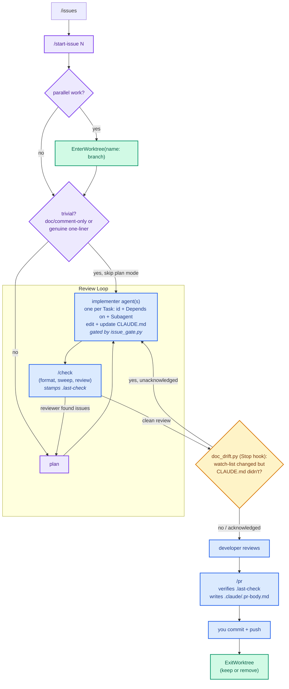

# Working in this repo

Four rules hold here, and all four are enforced mechanically rather than by convention.

## 1. No change without a GitHub issue

Every change traces to an issue. Issues are opened from the templates at
`.github/ISSUE_TEMPLATE/` — `blank_issues_enabled: false`, so there is no freeform option, and each
template prefills a Conventional-Commit title (`feat:`, `fix:`, `refactor:`, `docs:`, `test:`).

**Enforcement:** `.claude/hooks/issue_gate.py` runs as a `PreToolUse` hook on `Edit|Write` and
*denies* the edit unless `.claude/.current-issue` records an issue for the current branch. It also
refuses any edit made while on `main`, and refuses a record that was written for a different branch.

Run `/start-issue <number> [more...]` to open the gate. One branch may carry several issues — that
is normal here; record them all.

**Direct prompts, not just `/start-issue`.** A change requested directly, with no issue on
record, gets the same treatment `/new-issue` gives a user-typed command: the `issue-drafter`
agent (`.claude/agents/issue-drafter.md`) is dispatched to match a template, ask follow-ups
(implementation approach, whether to split into multiple issues, parent/sub-issue linkage,
milestone), and wait for explicit approval before creating the issue and branch and proceeding —
never a silent auto-create.

Deliberately not gated: paths outside the repo, and `.claude/**` (otherwise this configuration
could never be repaired). `.claude/CLAUDE.md` lives inside that exemption — a change to it alone
does not need a recorded issue, unlike root `CLAUDE.md` did before the move; root `CLAUDE.md` is
now just a one-line `@.claude/CLAUDE.md` stub, kept there because Claude Code auto-loads project
instructions from repo root, not from `.claude/`. Known gap: the gate covers `Edit`/`Write`, not
shell redirection through `Bash`.

## 2. Format and static analysis run once per change, at `/check`

`.github/workflows/ci.yml` only gates on `pull_request` to `main`, so a CI failure otherwise
surfaces long after the fact. `/check` is the local mirror that catches it first.

**Enforcement:** `/check` is the final step of every plan. It runs in three parts:

- **clang-format** is applied *in place* (`-i -style=file`) over `src/` and `include/`. Formatting
  has one correct answer, so it is fixed rather than reported. This must precede the sweep:
  `scripts/ci-local.sh` verifies formatting with `--dry-run --Werror` under `set -euo pipefail`, so
  an unformatted file would abort the run before cppcheck, clang-tidy or the build execute.
- **`scripts/ci-local.sh`** then runs the full sweep — format check, cppcheck, clang-tidy, build —
  mirroring `ci.yml` except for CodeQL (run in the background — the first pass can take several
  minutes).
- **The `reviewer` agent** (`.claude/agents/reviewer.md`) then runs a read-only pass over the
  branch's `src/`/`include/` diff — structure, efficiency, long-term validity, isolation of
  objects & behavior — once the sweep above has passed. Skipped when the diff touches neither
  directory. It reports findings; it does not edit.

**Plan mode has a narrow exemption.** A single-file edit that is purely documentation/comment
text, or a genuine one-line fix, may skip formal plan mode — state the change in a sentence and
proceed. Anything touching `src/`/`include/` behavior, spanning multiple files, or otherwise
non-trivial still goes through the full plan-mode flow in `/start-issue`.

Nothing is checked while you write. There is deliberately **no `PostToolUse` hook**: the tools
themselves are cheap (~0.11s each), but on Windows every invocation pays a WSL spawn of over a
second, and per-file cppcheck sees less than a whole-tree run does.

## 3. Claude never commits or pushes

`git commit` and `git push` are in `permissions.deny` in `.claude/settings.json`, for both the Bash
and PowerShell tools. Staging, branching, diff and log remain available. `/pr` prepares the title
and body and hands the push/create commands back to you.

---

## 4. CLAUDE.md is checked against reality

CLAUDE.md makes claims that go stale silently: which hooks are wired, which commands exist, how
formatting is enforced. Each claim has a file behind it.

The primary mechanism is the **plan**: `/start-issue` requires every plan to say whether the change
earns a CLAUDE.md update, so documentation is written with the code rather than bolted on. Update it
for a new subsystem, a file-layout change, ownership moving between types, a changed convention, or
a placeholder becoming real. Skip it for renames, small refactors and bugfixes — it is a map, not a
changelog.

**Backstop:** `.claude/hooks/doc_drift.py` runs as a `Stop` hook for when that is forgotten. It
compares the branch's changed files against a watch list (`.claude/settings.json`, `.claude/commands/`, `.claude/hooks/`,
`.claude/skills/`, `.claude/agents/`, `scripts/`, `.github/workflows/`, `CMakeLists.txt`, `.clang-format`,
`.clang-tidy`) and, when any of those changed but `.claude/CLAUDE.md` did not, blocks the stop with the list.

A hook cannot judge whether the docs are actually wrong — that needs reading both sides — so it
supplies the signal and leaves the call to the model. It fires once per distinct set of changes,
recorded in `.claude/.doc-drift-ack` (gitignored), so answering it either way does not loop.

It runs on `Stop`, not `PostToolUse`, for the reason in rule 2: once per turn, not once per write.
It shells out to nothing but `git`, so it costs no WSL spawn.

Note it hashes `.claude/CLAUDE.md` directly rather than looking for it in `git status`. A global
gitignore can exclude a file named `CLAUDE.md` at any depth — this repo's Windows developer has
exactly that — and an ignored file never appears in git output, which would make the prompt
impossible to answer by editing the file.

---

## Style: what the tools check, and what the skill checks

Rule 2 covers everything a linter can decide. The rest — naming, commenting, where a docstring
is allowed to go — lives in the `cpp-style` skill (`.claude/skills/cpp-style/SKILL.md`), which
auto-triggers on any `.cpp`/`.h`/`.hpp` work.

The skill deliberately carries **no scripts and no config copies**. There is one executable
definition of the checks per layer, and no more:

| Layer | Definition |
|---|---|
| Pre-PR | `scripts/ci-local.sh`, via `/check` |
| On the PR | `.github/workflows/ci.yml` — the authority |

`scripts/ci-local.sh` is the local mirror of `ci.yml` and is meant to be run by a human, with or
without Claude.

---

## Lifecycle Workflow



Each plan task states an id, a `Depends on: Task N` marker (or `independent`), and the subagent
that executes it — see `/start-issue`'s plan-writing step for the exact structure. Tasks marked
`independent` are dispatched to `.claude/agents/implementer.md` in parallel; a task with a
`Depends on` marker runs only after that dependency lands, sequentially. See rule 2 for the
review pass and plan-mode exemption.

Parallel issues run as separate sessions, each entering its own worktree via `/start-issue` — not
one session juggling several (`EnterWorktree` refuses a second isolated worktree once a session is
already inside one). Worktree cleanup (`ExitWorktree`: keep or remove) happens after merge,
prompted by `/pr`'s handoff or by the harness at session end — never automatic mid-session.

PR bodies stay short — a plain summary and change list, not a narration of how the change was
decided.

## Common commands

| Command | What it does |
|---|---|
| `/issues [filter]` | List open GitHub issues to pick from (`gh issue list`, repo resolved via `GH_REPO`) |
| `/new-issue <description>` | File a new GitHub issue, asking which milestone to assign (or creating one if explicitly told) — also how Claude handles a direct prompt with no issue on record |
| `/start-issue <n> [n...]` | Fetch the issue(s), cut a `<type>/<kebab-description>` branch off `main` (kebab-description ≤4 words, ideally <3), record `.claude/.current-issue`, then enter plan mode |
| `/check` | Full local CI sweep via `scripts/ci-local.sh` — format, cppcheck, clang-tidy, build — then a `reviewer`-agent pass over `src/`/`include/` changes, stamping `.claude/.last-check` |
| `/build [debug\|release]` | `scripts/build-debug.sh` / `scripts/build-release.sh` |
| `/run` | Build debug, run from the repo root, report `game.log` and `error.log` |
| `/pr` | Confirm `/check` is current, verify issue + branch, write `.claude/.pr-body.md`, print the push/create commands for you |

## Two environments — never hard-code one

This repo is worked on from macOS/Linux **and** from Windows, and the two differ in one way that
matters: on macOS/Linux the C++ toolchain (`clang-format`, `cppcheck`, `clang-tidy`, `cmake`) is on
PATH, while on Windows it is not — it lives in WSL. Git Bash supplies a `bash` on Windows but none
of the tools, so the presence of a shell is not a useful probe.

`.claude/hooks/_toolchain.py` makes that decision once, in `toolchain_argv()`, based on whether the
*tools* resolve. Hooks and slash commands both go through it, so there is a single code path.

**Never write `wsl.exe` into a command file** — it breaks the macOS/Linux developer. Route shell
work through the runner instead:

```bash
python3 .claude/hooks/toolchain_run.py 'bash scripts/ci-local.sh'
```

It runs the command directly on macOS/Linux and re-execs through WSL on Windows, streaming output
either way and propagating the exit status. `--where` prints which environment was picked.

Two portability rules that have already bitten:

- Each `wsl.exe` spawn costs over a second, so batch shell work into a **single** invocation
  rather than one per tool. This is why `/check` is two commands rather than five, and part of why
  per-write checking was dropped (see rule 2).
- `script(1)` takes different arguments on GNU (`script -qc CMD /dev/null`) and BSD/macOS
  (`script -q /dev/null CMD`). `/run` detects the flavour rather than assuming.

Installing the toolchain:

| Platform | Install |
|---|---|
| Debian/Ubuntu/WSL | `sudo apt install clang-format clang-tidy-19 cppcheck cmake libncurses-dev` |
| macOS | `brew install clang-format llvm cppcheck cmake ncurses` |

On macOS, Homebrew keeps ncurses keg-only and `scripts/build-*.sh` do not pass
`-DCMAKE_PREFIX_PATH="$(brew --prefix ncurses)"` the way `ci.yml` does — see `/build`.

## Branch and commit conventions

- Branches: `<type>/<kebab-description>` — `feat/`, `fix/`, `refactor/`, `chore/`, `docs/`, `test/`.
  Use `feat/`, not `feature/`; both appear in history but `feat/` is what recent work uses.
- Commits/PR titles: `type: Sentence-case description`. Squash-merge appends the PR number, so
  history reads `feat: Level config loading (#107)`. Optional scope: `fix(build):`.
- Issue linkage lives in the PR body's `Closes #N`, not in the commit message.
